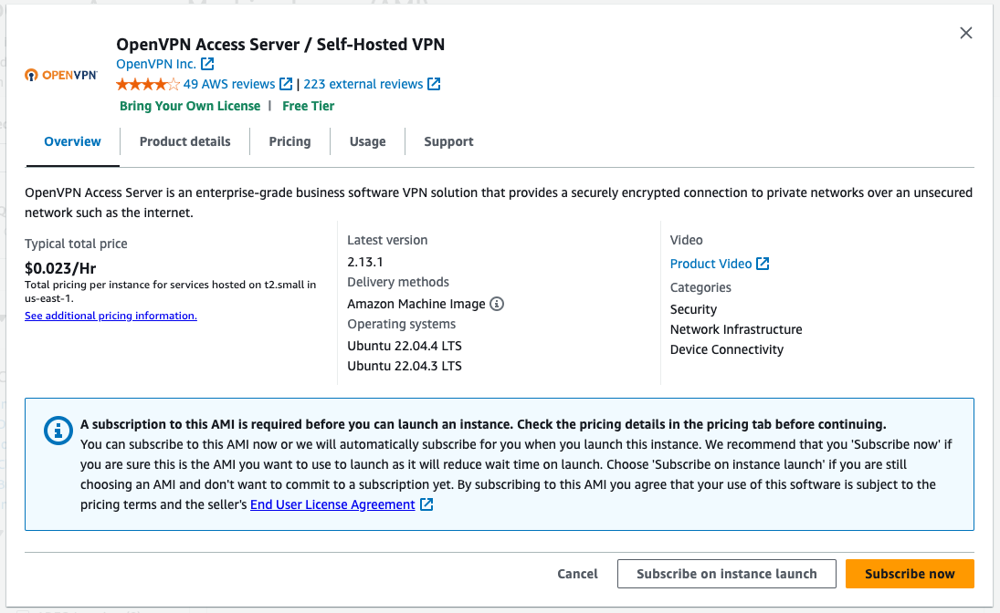
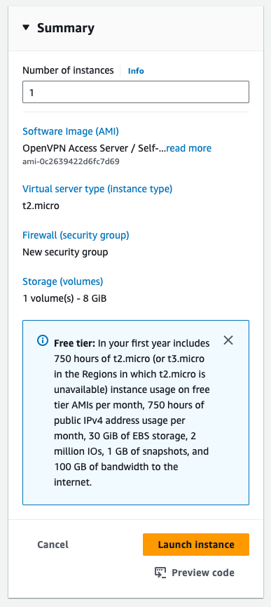

# Setting up OpenVPN server

1. Go to <https://aws.amazon.com/> and sign up for a free account.
2. Login to your account and go to the [Console](https://console.aws.amazon.com/console/).
3. Select your preferred region (eg. Singapore).
4. Search of `EC2` service. Or just click [here](https://ap-southeast-1.console.aws.amazon.com/ec2/home).
5. Click on "Launch Instance"

	

6. Give it a name: **"OpenVPN Server"**
7. Click on **"Browse more AMIs"**

	
	
8. Click on **"AWS MarketplaceAMIs"** tab.
9. Search for **"openvpn"**.

	

10. Click **"Select"** button on **"OpenVPN Access Server / Self-Hosted VPN"**

11. Click on **"Subscrribe on instance launch"**.

	
	
12. Next, select an **"Instance type"**. Pick `t2.micro` as its **"Free Tier Eligible"**.

	
	
13. If this is your first time spinning up an EC2 instance, click on **"Create new key pair"**.

	
	
	- Give it a name.
	- Click on **"Create key pair"** to download the `*.pem` file.

14. **"Network settings"** can leave it as the default.

	
	
	- Make sure the items in red box are selected.

15. Click on **"Launch instance"**

	
	
16. Wait for the instance to launch.
17. Once its launched, select the instance in the EC2 Instance list.
18. Click on "Actions" and click on "Connect". You will be given instructions on how to SSH into your EC2 instance.
19. Copy the command line and use that in your Terminal.
20. Change the user from **"root"** to **"openvpnas"**. Notice to run this with where you downloaded the `*.pem` file.

	```bash
 	ssh -i "<path/to/key.pem>" openvpnas@<ip_address_of_ec2_instance>
 	```

 	Example:
	```bash
 	ssh -i "~/.ssh/miccheng_dev.pem" openvpnas@ec2-122-248-220-168.ap-southeast-1.compute.amazonaws.com
 	```

23. Once you login, you will be prompted to setup the OpenVPN server. Use default values for most of the prompts (just press enter). Make sure that the **network** and **DNS traffic** are all routed through the VPN server.
25. Set a password for **"openvpn"** user.
26. Install the [**OpenVPN Connect Client**](https://openvpn.net/client/) on your machine or mobile device.
27. In the client, use the server URL (eg. https://50.50.2.1:943) to login with your user account (**"openvpn"**). This will download the OpenVPN profile.

 	> **Note:** You can find the public IP address from the AWS EC2 Console.

29. Remember to save the password so you don't have to type in the password every time you start the VPN.
